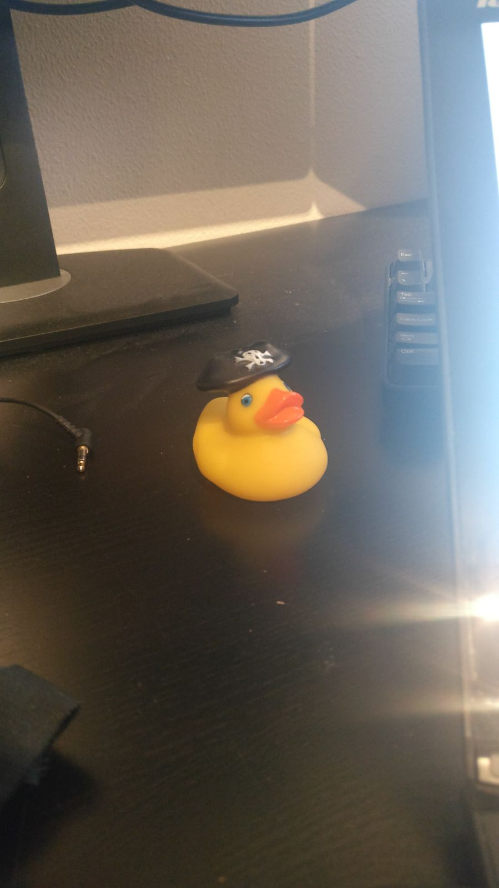

## Extra time

In this document I show how I spend the extra 20 hours for frontend 3. The most time is spend on research for the assessments and  assignments. Next to that I did get to learn my duck very well. Bellow you can see an extensive explanation of what I did.

## Spending my time (well?!)

For this course I spend my time on a few things. Below you can find a full list.

Before I started this course I had to get to know javascript again. In the last half year I didn't use any code. This because of a design intership and an holiday without working on code. The bootcamp of the first class did help me alot, but I wanted to be better prepared. 

For preparation of the class I did some research in javascripting. The research consisted of reviewing code I wrote earlier. I went over every line and looked if I understand everything. Next to that I read the important parts of the [You don't know JS](https://www.amazon.com/You-Dont-Know-JS-Going/dp/1491924462) book.

# Where did my time go

Next to reading about code I wanted to learn D3 better. Before the class I didn't really know what to expect, but then it turned out to be more difficult then I thought. 

For the first assignments I did some research in D3 to learn the basics. Websites I read where:

* [A D3 introduction](https://d3js.org/#introduction)
* [TimeParse](https://github.com/d3/d3-time-format#timeParse)
* [Nest](https://github.com/d3/d3-collection/blob/master/README.md#nest)
* [Transitions](https://github.com/d3/d3-transition)

Next to this I read some code already wrote. The code I read was mostly of Mike Bostock.

# Assignment and Assessments

For the most part my extra time went into researching problems in my own code. I had the most problems with code that was already writen and I wanted to change. For that I went through the whole [stack overflow](https://stackoverflow.com/).

This is a list of the websites I used for the assignments and assessments:

* [From D3 v3 to D3 v4](https://github.com/d3/d3/blob/master/API.md)
* [Pushing](https://developer.mozilla.org/nl/docs/Web/JavaScript/Reference/Global_Objects/Array/push)
* [Difference between slice and splice](http://www.tothenew.com/blog/javascript-splice-vs-slice/)
* [Enter, Update, Exit](http://bl.ocks.org/alansmithy/e984477a741bc56db5a5)
* [Enter, Update, Exit (but from other source)](https://medium.com/@c_behrens/enter-update-exit-6cafc6014c36)
* [Grouping](http://learnjsdata.com/group_data.html)
* [Multiple data in one chart](https://bl.ocks.org/mbostock/3884955)
* [Multiple charts](https://stackoverflow.com/questions/16714271/trying-to-add-multiple-d3-graphs)

> I also learned a lot from the questions that where asked on [slack](https://cmdinformationdesign.slack.com/messages/C6X4TNPQA/)
 
# Learning from teaching

Next to all links I read I also put some extra time in helping others. With assessment 3 all done (for me) I had some time to help my fellow students out with questions they had. Next to that I explained my code to a friend who didn't have frontend 3. It was my challenge to explain my code in a way he could understand. After that he wanted also to write some code himself and I helped him with that. 

> He did understand it eventually :D

# My duck

My extra time went ofcourse into talking to my duck. I wanted to know him better. And yes, **him**. He is named Yellow Beard. And you have to know how much he knows about code. And especially D3. That is insane. I talked with him about his past and how he became so good in writing code.

Yellow Beard was a notorious English pirate who operated around the West Indies and the eastern coast of Britain's North American colonies. He was born in Amsterdam, England. He has been a sailor on privateer ships during Queen Anne's War before settling on the Bahamian island of New Providence, a base for Captain Benjamin Hornigold, whose crew Teach joined sometime around 2016. Hornigold placed him in command of a sloop he had captured, and the two engaged in numerous acts of piracy. Their numbers were boosted by the addition to their fleet of two more ships, one of which was commanded by Stede Bonnet, but towards the end of 2017 Hornigold retired from piracy. With his last trip he anded up in the Netherlands, also Yellow beard was with him. Yellow Beard had no job anymore after Hornigold. That is when Yellow Beard got into code. After a few months Javascripting and using D3 he came in the hands of the well known and great leader Titus Wormer. He would then pass Yellow Beard through to me.

With knowing him better it was easier to talk with him about code. Together with him I could conquer all assessments. He helped me the most with assessment 3. The most bugs I had I could solve together with them.

GPL 3.0 © Victor Zumpolle
